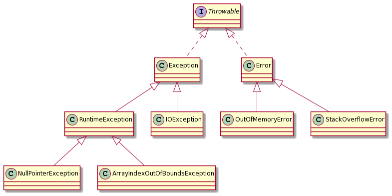

= Professionelle Softwareentwicklung: Woche 6
:icons: font
:icon-set: fa
:source-highlighter: rouge
:experimental:
ifdef::env-github[]
:tip-caption: :bulb:
:note-caption: :information_source:
:important-caption: :heavy_exclamation_mark:
:caution-caption: :fire:
:warning-caption: :warning:
endif::[]

== Begrüßung und Organisatorisches 
Schauen Sie sich das https://youtu.be/qGNbs1LuQ0o[Begrüßungsvideo] an.

=== Anmeldung zur vierten praktischen Übung
Die vierte praktische Übung findet in der KW 23 (07.06.2021 bis 11.06.2021) statt. Die Anmeldefrist ist vom 02.06.2021, 08:30 Uhr bis 03.06.2021, 14:30 Uhr.

== Aufgabe 1: Testing 

[quote, Brenan Keller]
____
A QA engineer walks into a bar. 
Orders a beer. 
Orders 0 beers. 
Orders 99999999999 beers. 
Orders a lizard. 
Orders -1 beers. 
Orders a ueicbksjdhd. 

First real customer walks in and asks where the bathroom is. The bar bursts into flames, killing everyone.
____

=== Einführung

Schauen Sie sich das https://youtu.be/0oQNUEN1DbY[Einführungsvideo] zum Thema Testing an. 

=== Testszenarien auswählen

In den meisten Fällen sind Unit-Tests sogenannte Example-Based Tests. Dabei beschreiben wir, wie sich die zu testende Einheit in festgelegten Szenarien verhalten soll. Nehmen wir als Beispiel eine Funktion, die Quadratwurzeln berechnen soll. 

Wir könnten nun einige Eingaben für die Funktion festlegen und beschreiben, wie die Rückgaben der Funktion aussehen sollen. 

[cols="1,1"] 
|=== 
|Eingabe | Erwartete Rückgabe  

|4 
|2.0 ± 0.00001

|2
|1,41421 ± 0.00001

|0
|0.0 ± 0.00001

|-3
|`IllegalArgumentException`

|=== 

Die große Kunst beim "Example-Based Testing" ist die Auswahl der Testfälle. Wir wollen nicht zu viele Tests haben, aber wir wollen das gesamte relevante Verhalten testen. 

Das Schreiben guter Tests erfordert etwas Übung, aber es gibt einige Aspekte, die wir beachten sollten. Es ist zum Beispiel in der Regel eine gute Idee, die Grenzfälle zu betrachten. Was so ein Grenzfall ist, hängt natürlich vom Code ab, aber für Zahlen sollten wir zum Beispiel die 0 anschauen, positive und negative Werte benutzen und gerne auch an die Grenzen des Datentyps gehen, also zum Beispiel Fälle, in denen `Integer.MAX_VALUE` über- bzw. `Integer.MIN_VALUE` unterschritten wird. Für Referenztypen sollten wir auch immer mal `null` in Betracht ziehen. Für Listen, Mengen, Maps sollten wir auch immer an die leeren Listen, Mengen, Maps denken.

NOTE: Diese Grenzfälle sollten wir übrigens auch immer in Erinnerung rufen, wenn wir den Code schreiben. 

=== JUnit und AssertJ in Gradle konfigurieren

Das JUnit Framework ist der de facto Standard für Java Tests. In der "The State of Developer Ecosystem" Umfrage von JetBrains von 2019 gaben 93% aller Personen, die Unit-Test für Java schreiben an, dass sie JUnit verwenden. AssertJ ist eine Bibliothek, mit der uns ein umfassenderes Angebot an Assertions zur Verfügung steht als mit JUnit alleine. Wie immer wollen wir Gradle verwenden, um unsere Projekte zu bauen und zu testen.

Zur Verwendung von JUnit 5 müssen wir dazu Dependencies einbinden und zusätzlich Gradle mitteilen, dass wir JUnit verwenden wollen. IntelliJ fügt, wenn wir ein Projekt erzeugen, automatisch JUnit als Dependency hinzu.

[source, gradle]
----
dependencies {
    testImplementation 'org.junit.jupiter:junit-jupiter-api:5.7.0'
    testRuntimeOnly 'org.junit.jupiter:junit-jupiter-engine:5.7.0'
}

test {
    useJUnitPlatform()
}
----

Zusätzlich wollen wir auch noch die Testausgabe etwas feintunen und alle Tests auf der Konsole ausgegeben. Im Normalfall sollten wir das nicht so machen, denn bei vielen Tests produzieren wir dann deutlich zu viel Output. Anfangs ist es aber ganz gut geeignet um zu überprüfen, dass auch Tests ausgeführt werden.

[source, groovy]
----
plugins {
    id 'java'
}

repositories {
    mavenCentral();
}

dependencies {
    testImplementation 'org.assertj:assertj-core:3.19.0'
    testImplementation 'org.junit.jupiter:junit-jupiter-api:5.7.0'
    testRuntimeOnly 'org.junit.jupiter:junit-jupiter-engine:5.7.0'
}

test {
    useJUnitPlatform()
    testLogging {
        events "passed", "skipped", "failed"
    }
}
----

Im Normalfall verwenden wir `gradle check`, um die Tests auszuführen. Es werden dann alle Überprüfungen gestartet. Die Tests sind dabei ein Teil dieser Überprüfungen. Wenn wir ausschließlich die Tests laufen lassen wollen, geht das mit `gradle test`.

Nachdem die Tests ausgeführt wurden, gibt es in `build/reports/tests/test/index.html` einen generierten Report, der das Ergebnis der Ausführung anzeigt. 

=== Tests schreiben

Schauen wir uns zunächst eine "pure function" an. Solche Funktionen sind den Funktionen, die Sie aus der Mathematik kennen, sehr ähnlich. Das Resultat einer "pure function" ist ausschließlich von den Eingabeparametern der Funktion abhängig und die Funktion hat keine Seiteneffekte. Seiteneffekte sind zum Beispiel die Änderung des Zustands eines Objektes, Ausgabe auf der Konsole, Abschicken einer Mail oder Auslösen eines weltweiten thermonuklearen Kriegs. Logische Konsequenz ist, dass eine "pure function", wenn sie dieselben Eingaben bekommt, auch immer dieselbe Ausgabe produzieren muss.

Betrachten wir eine Funktion zur Berechnung des Sinus einer Zahl mit folgender Signatur: 

[source, java]
----
public class Sinus {
    public static double von(double v) {
      // ... 
    }
}
----

Die Funktion könnte zum Beispiel mit 
[source, java]
----
double sin = Sinus.von(1.4);
----

aufgerufen werden. Um die Funktion zu testen, können wir bekannte Ein- / Ausgabepaare verwenden. Der Sinus von 0 ist zum Beispiel 0, der Sinus von π/2 ist 1, usw.

Ein Testfall für π/2 könnte so aussehen: 

[source, java]
----
@Test
void test_sin_pi_halbe() {
    double sin = Sinus.von(Math.PI/2);
    assertEquals(1.0, sin, 1e-5);
}
----

Es gibt hier keinen Arrange-Schritt, da eine statische Funktion getestet wird, die keinerlei Kontext benötigt. Der Act-Schritt ist der Aufruf der Funktion mit π/2. Der Assert-Schritt ist dann der Vergleich des erwarteten Ergebnisses `1.0` mit dem berechneten Ergebnis `sin` unter Berücksichtigung einer Toleranz von `±0,00001`. 

Wie wir sehen, hat JUnit auch Möglichkeiten um Assertions zu schreiben, diese sind aber sehr limitiert. Wir werden uns auf die Verwendung von AssertJ als Assertions-Bibliothek festlegen. Wenn wir AssertJ verwenden, sieht der Test so aus:

[source, java]
----
@Test
void test_sin_pi_halbe_assertj(){
    double sin = Sinus.von(Math.PI/2);
    assertThat(sin).isCloseTo(1.0, offset(1e-5));
}
----

Die Assertion liest sich hier fast wie natürliche Sprache, während wir bei der JUnit Assertion immer im Kopf halten müssen, welcher Wert an welcher Stelle im Aufruf kommt.

Schauen Sie sich dieses Video über https://youtu.be/vOTL9528XbI[AssertJ] an (den Code finden Sie im Ordner `junit`) und arbeiten Sie das https://bit.ly/vogel_assertj[AssertJ Tutorial] von Lars Vogel durch.

Fehlschläge werden nicht über Rückgabewerte angezeigt, stattdessen wirft eine fehlschlagende Assertion einen `AssertionError`. Das JUnit-Framework fängt alle Subtypen des Interfaces `Throwable` und interpretiert sie als Fehlschlag des Tests. Das bedeutet also, dass sowohl Exceptions, die während der Ausführung des Codes auftreten, als auch Verletzungen einer Assertion im Test als Fehlschlag gewertet werden.

Gelegentlich erwarten wir, dass unser Code eine Exception produziert. Dazu existieren spezielle Assertions, die dafür sorgen, dass der Test fehlschlägt, wenn die Exception *nicht* geworfen wird. Hier ist ein Beispiel, in dem wir erwarten, dass der Code einen Fehler produziert, wenn wir durch 0 teilen. Wir verwenden die `assertThrows` Methode, die ein Stück Code übergeben bekommt, und prüft, dass bei der Ausführung eine bestimmte Exception geworfen wird. Die `assertThrows` Methode gibt die Exception zurück, sodass wir diese noch genauer untersuchen können. 

[source, java]
----
@Test
void test_divideByZero() {
    Executable code = new Executable() {
        public void execute() throws Throwable {
            Division.div(2, 0);
        }
    };
    ArithmeticException exception = assertThrows(ArithmeticException.class,
            code);
    assertThat(exception.getMessage()).contains("by zero");
}
----

Dieser Code wirkt noch etwas sperrig, aber glücklicherweise ist `Executable` ein funktionales Interface und wir können daher einen Lambda-Ausdruck verwenden.

[source, java]
----
@Test
void test_divideByZero() {
    ArithmeticException exception = assertThrows(ArithmeticException.class,
            () -> Division.div(2, 0));
    assertThat(exception.getMessage()).contains("by zero");
}
----

WARNING: Testen auf Exceptions kann gelegentlich sinnvoll sein, es ist aber eher sparsam zu verwenden. 

Schauen wir uns nun ein Beispiel mit Zustand an. Wir verwenden dazu einen ganz einfachen Counter. Der Counter hat eine Methode `tick`, welche den Counter um eins erhöht und eine Methode `getCount`, die den aktuellen Wert zurückgibt.

[source, java]
----
public class Counter {
    private int count;

    public void tick() {
        count++;
    }

    public int getCount() {
        return count;
    }
}
----

Eine Testklasse mit einem ersten Test könnte so aussehen:

[source, java]
----
public class CounterTest {

    private Counter counter = new Counter();

    @Test
    void testSingleTick() {
        counter.tick();
        assertThat(counter.getCount()).isEqualTo(1);
    }
}
----

Nun fügen wir einen weiteren Test hinzu:

[source, java]
----
@Test
void testTwoTicks() {
    counter.tick();
    counter.tick();
    assertThat(counter.getCount()).isEqualTo(2);
}
----

Auch dieser Test funktioniert. Aber wieso? Schließlich greifen wir in beiden Tests auf dieselbe Instanz von Counter zu. Es wäre zu erwarten, dass einer der beiden Tests durch den verschmutzten Zustand ein Problem bekommt. 

Hier hilft uns die Standardeinstellung für die Ausführung von Tests in JUnit. Obwohl beide Testfälle in der gleichen Klasse sind, führt JUnit jeden Testfall mit einer eigenen Instanz der Klasse aus. Es wird also ein Objekt der Klasse `CounterTest` für jede Methode erzeugt, die beiden Testfälle verwenden folglich auch zwei unterschiedliche Instanzen von Counter. 

Wir können das Verhalten mithilfe von `@TestInstance(PER_CLASS)` ändern. Wenn wir die Testklasse so annotieren, werden alle Tests in der gleichen Instanz der Testklasse ausgeführt. Wir könnten im Prinzip auch das `counter`-Attribut statisch machen, dann verwenden beide Tests zwar unterschiedliche Instanzen der Testklasse, aber dieselbe Instanz von `counter`. Wenn wir `@TestInstance(PER_CLASS)` verwenden oder den Counter `static` deklarieren, schlägt einer der Tests fehl. 

Welcher der Tests genau fehlschlägt, wird durch die Ausführungsreihenfolge bestimmt. Über die Ausführungsreihenfolge von Tests sagt die JUnit-Dokumentation "By default, test methods will be ordered using an algorithm that is deterministic but intentionally nonobvious.". 

Es ist ein Vorteil, dass die Reihenfolge der Ausführung standardmäßig nicht offensichtlich ist. Solange wir die Reihenfolge nicht ändern, motiviert uns JUnit dazu, unsere Tests so zu schreiben, dass sie voneinander isoliert sind.

In seltenen Fällen ist es notwendig die Ausführungsreihenfolge der Tests zu ändern. 
Das kann zum Beispiel der Fall sein, wenn die Herstellung des Kontexts sehr teuer ist und die Performance zu schlecht wäre, wenn wir den Kontext nicht weiterverwenden würden. Oder es kann auch sein, dass wir echte zufällige Reihenfolgen brauchen.  
In diesen Fällen können wir mithilfe der `@TestMethodOrder` Annotation die Kontrolle über die Ausführungsreihenfolge übernehmen. 
In `CounterRandomOrderTest` und `CounterOrderTest` ist eine feste Reihenfolge mithilfe von `@Order` Annotationen an den Tests und eine von Durchlauf zu Durchlauf unterschiedliche Reihenfolge demonstriert. Eine zufällige Reihenfolge der Tests kann die Unabhängigkeit verbessern, kann aber die Wiederholbarkeit verschlechtern. Die Standardreihenfolge ist ein Kompromiss. 

WARNING: Wir sollten in den allermeisten Fällen davon absehen eine Testreihenfolge festzulegen. 

=== Kontexte herstellen 

Wenn wir zustandsbehafteten Code testen, dann müssen wir im Arrange-Schritt des Tests den Initialzustand herstellen. Dabei kommt es relativ oft vor, dass wir in vielen Tests den gleichen Code schreiben. In Tests sind Wiederholungen tendenziell etwas eher geduldet als im Produktivcode, aber Wiederholungen verstärken die Kopplung des Tests an den Code. Der Grund dafür ist, dass eine Änderung am Code potenziell dafür sorgt, dass sehr viele aufrufende Stellen geändert werden müssen. 

JUnit stellt uns vier Annotationen für Methoden zur Verfügung `@BeforeAll`, `@BeforeEach`, `@AfterAll` und `@AfterEach`. Die Methoden, die mit `@BeforeEach` bzw. `@AfterEach` annotiert sind, werden vor bzw. nach jedem einzelnen Testfall ausgeführt. Methoden, die mit `@BeforeAll` bzw. `@AfterAll` annotiert sind, werden einmal für jede Testklasse ausgeführt.

Wir können natürlich auch einfach selber Methoden (oder sogar Klassen) schreiben, die uns bei der Erzeugung des Kontexts helfen. Bei komplexen Objektgraphen kann so etwas besonders hilfreich sein. Wenn wir zum Beispiel Software schreiben, die Bestellungen von Kund:innen verarbeitet, dann könnten wir Methoden schreiben, die uns fertige exemplarische Kund:innen erzeugen, zum Beispiel einen Kunden, der mit Kreditkarte zahlt, oder eine Kundin, die im Ausland wohnt. 

[source,java]
----
public static Buch effective_java() {
    Buch ej = new Buch(new ISBN13("978-0134685991"));
    ej.setTitle("Effective Java, 3. Edition");
    return ej;
}
public static Kunde lisa_maier() {
    Kunde lisa = new Kunde("Lisa Maier", Zahlmethode.CC);
    lisa.addToCart(effective_java(), 1);
    lisa.setShipping("FedEx");
    lisa.setAddress("1 Infinite Loop Cupertino, CA 95014");
    return lisa;
}
----

In einem Test können wir diese Template-Methoden verwenden, um uns typische Exemplare der zu testenden Klassen zu erzeugen. 

=== Ausführung verhindern

Tests haben in den meisten Fällen zwei mögliche Resultate. Ein Test kann fehlschlagen (`failed`, `red`) oder nicht fehlschlagen (`passed`, `green`, `durchgelaufen`). Es gibt eine dritte Möglichkeit: Ein Test kann nicht ausgeführt werden (`ignored`, `disabled`, `skipped`).

In JUnit lassen sich Tests *temporär* ausschalten, indem wir sie mit `@Disable` annotieren. Wir sollten dort auch einen Grund angeben, warum wir den Test deaktivieren. Ein deaktivierter Test könnte so aussehen:

[source, java]
----
@Test
@Disabled("Siehe optionale Aufgaben")
void test_sin_40Pi() {
    double sin = Sinus.von(40 * Math.PI);
    assertEquals(0.0, sin, 1e-5);
}
----

IMPORTANT: Bei der Ausführung werden Tests, die deaktiviert sind, nicht als "passed" oder "failed" sondern als "skipped" angezeigt. 

Manchmal ist ein Test auch vom Ausführungskontext abhängig. Obwohl die meisten Java Programme plattformunabhängig sind, gibt es manchmal Fälle, in denen wir bestimmte Tests nur unter bestimmten Umständen laufen lassen wollen. Für solche Fälle können _Assumptions_ verwendet werden. Eine Assumption (in AssertJ) sieht folgendermaßen aus:

[source, java]
----
@Test
void test_only_on_monday() {
    assumeThat(now().getDayOfWeek()).isEqualTo(MONDAY);
    // der Test wird nur montags ausgeführt
}
----

Wenn eine Assumption fehlschlägt, dann wird der Test abgebrochen und übersprungen, als wäre er mit `@Disabled` annotiert. Mit Assumptions lassen sich vollkommen beliebige Bedingungen an die Ausführung stellen, da wir ja beliebigen Java Code ausführen können. 

Im Normalfall wird das aber gar nicht gebraucht. Typischerweise wird die Ausführung auf bestimmte Betriebssystemen oder Java Versionen beschränkt, oder sie wird mithilfe einer System-Property oder Umgebungsvariable gesteuert. Für diese Zwecke gibt es spezielle Annotationen. Für jede dieser Annotationen gibt es eine "Enabled" und eine "Disabled" Variante. Im Folgenden schauen wir uns nur die "Enabled" Varianten an.

Für Betriebssysteme gibt es die Annotationen `@EnabledOnOs`. Ein Beispiel für eine Verwendung ist `@EnabledOnOs({LINUX, MAC})`. Es ist hier zu beachten, dass das Betriebssystem nur sehr grob spezifiziert wird. Es gibt keine Möglichkeit die Version des OS genauer zu bestimmen.  

Für Java Versionen gibt es `@EnabledOnJre` und `@EnabledForJreRange`. Damit können Tests für bestimmte Versionen oder auch für (offene) Bereiche von Versionen geschrieben werden. Wenn wir zum Beispiel einen Test schreiben, der sich auf das Modulsystem von Java (ab Version 9) bezieht, dann ginge das mit `@EnabledForJreRange(min=JAVA_9)`. 

Es gibt dann auch noch die Möglichkeit, die Testausführung mithilfe von System-Properties (`@EnabledIfSystemProperty`) und Umgebungsvariablen (`@EnabledIfEnvironmentVariable`) zu steuern. Eine typische Verwendung von System Properties wäre eine Überprüfung auf die CPU Architektur. Der folgende Test würde nur auf einer 64 Bit Architektur ausgeführt:

[source, java]
----
@Test
@EnabledIfSystemProperty(named = "os.arch", matches = ".*64.*")
void test_for_64bit() {
    // ...
}
----

Umgebungsvariablen werden sehr ähnlich verwendet. Ein typischer Anwendungsfall ist die Unterscheidung, ob der Test auf einem Entwicklungsrechner oder auf einem automatischen Testserver ausgeführt wird. Einen Teil der Tests sollen vielleicht tatsächlich nur auf dem Testserver laufen, zum Beispiel aus Performancegründen oder weil es zu komplex ist, eine Umgebung, die dem Produktivsystem ähnlich genug ist, auf jedem Entwicklungsrechner aufzusetzen. 

=== Testorganisation 

Tests müssen schnell sein, damit wir sie während der Entwicklung als Feedback nutzen können. Wenn wir nicht alle Tests so schreiben können, dass sie schnell laufen, dann bleibt uns noch die Möglichkeit unserer Tests zu gruppieren und unterschiedlich oft laufen zu lassen. Die schnellen Tests lassen wir zum Beispiel immer laufen, wenn wir eine Datei speichern, die etwas langsameren lassen wir seltener laufen. So können wir einen Kompromiss finden zwischen gründlichem Testen und schnellem Feedback. 

In JUnit 5 steht uns zur Gruppierung von Tests die `@Tag` Annotation zur Verfügung. Mithilfe von `@Tag` können wir eine Art Schlagwort mit einem Test assoziieren und dann verwenden, um eine Selektion von Tests durchzuführen. Die angesprochene Aufteilung in Performanceklassen ist eine Möglichkeit. Wir können aber auch zum Beispiel fachliche Tags unterbringen, um so Tests für bestimmte Funktionalitäten separat auszuführen. Es können mehrere `@Tag` Annotationen sowohl an einer Klasse, als auch einer Testmethode geschrieben werden. In folgender Testklasse ist zum Beispiel jeder Test mit `filtering` getagged und der `test_slow` Test zusätzlich mit `slow` und `integration`.

[source, java]
----
@Tag("filtering")
public class TagTest {

    @Test
    @Tag("unit")
    @Tag("fast")
    void test_fast(){
        System.out.println("FAST!!!");
    }

    @Test
    @Tag("slow")
    @Tag("integration")
    void test_slow(){
        System.out.println("Zzzz ... slow");
    }

}
----

Wir können nun Gradle so konfigurieren, das die Tags beachtet werden. Im folgenden Beispiel exkludieren wir langsame Tests im Standardfall und wir fügen einen neuen Task `integrationTest` hinzu, der aufgerufen wird, wenn wir `gradle check` verwenden: 

[source, groovy]
----
test {
    useJUnitPlatform { excludeTags 'slow' }
}

task integrationTest(type: Test) {
    useJUnitPlatform { includeTags 'slow' }
    check.dependsOn it    // `it` ist so ähnlich wie `this` in Java
    shouldRunAfter test   // erst normal testen, dann die langsamen Tests
}
----

=== Testnamen 

Ein extrem nützliches Feature von JUnit 5 ist die Möglichkeit erklärende Texte für Testklassen und -methoden schreiben zu können. Diese Texte werden anstelle der Methoden-Namen im Testreport verwendet. 

[source,java]
----
@DisplayName("Ein Stack mit den Elementen 1, 2 und 3 ")
public class StackTest {

    private Stack<String> stack;

    @BeforeEach
    void setup() {
        stack = new Stack<>();
        stack.push("1");
        stack.push("2");
        stack.push("3");
    }

    @DisplayName("sollte ein viertes Element speichern können")
    @Test
    void test_add_single_element() {
        stack.push("4");
        assertThat(stack).hasSize(4);
    }

    @DisplayName("sollte 3 zurückgeben, wenn pop aufgerufen wird und danach nur noch zwei Elemente haben")
    @Test
    void test_pop() {
        String top = stack.pop();
        assertThat(top).isEqualTo("3");
        assertThat(stack).hasSize(2);
    }
}
----

TIP: Verwenden Sie nach Möglichkeit immer `@DisplayName`, um ihre Tests verständlicher zu schreiben.

*Leitfragen/Aufgaben:*

* Was ist das Allerwichtigste bei Tests?

* Stellen Sie sicher, dass Sie den Sinn der FIRST Regeln verstehen. Überlegen Sie sich für jede Regel: Warum ist diese Regel sinnvoll und notwendig? 

* Jahre, die durch 4 teilbar sind, sind Schaltjahre. Ausnahmen sind Jahre, die durch 100, aber nicht durch 400 teilbar sind. Schreiben Sie ein Programm *und* alle notwendigen JUnit-Tests um zu berechnen, ob ein Jahr ein Schaltjahr ist. 

* Finden Sie ein Beispiel, wo Tests einen mathematischen Beweis für die Korrektheit einer Software darstellen. Geben Sie für das gewählte Beispiel die Tests an. 

* Schauen wir und einmal folgende Methode an, die eine Zufallszahl zwischen 1 und `n` zurückgibt.
+
[source, java]
----
public int w(int n) {
  return (int)(Math.random() * n + 1);
}
----
+
Bei mehreren Aufrufen mit demselben Parameter gibt die Funktion unterschiedliche Werte zurück, sie kann also, nach unserer Behauptung, nicht pure sein. Aber wo ist der Seiteneffekt?

* Lassen Sie die Tests im `junit` Ordner mit `./gradlew check` von der Kommandozeile aus laufen und schauen Sie sich den generierten Report an. Schalten Sie einen Test aus, ändern Sie den DisplayName, bringen Sie einige Tests dazu fehlzuschlagen und schauen Sie sich an, wie sich die einzelnen Änderungen auf den Report auswirken.

* Ändern Sie das Attribut `counter` in der `CounterTest` Klasse so, dass es statisch ist und lassen Sie die Tests laufen. Welcher Test schlägt fehl und warum gerade dieser?

* Bringen Sie den Test in `DivisionTest` durch Veränderung von `Division` (also nicht durch Veränderung des Tests!) zum Fehlschlag.

* Schreiben Sie eine Klasse `Quadrat` mit einer statischen Methode `von`, die einen Integerwert bekommt und das Quadrat des Wertes zurückgibt. Was ist der Rückgabetyp Ihrer Methode, wenn die Methode immer das mathematisch korrekte Ergebnis zurückgeben soll? Schreiben Sie die notwendigen JUnit Tests um die Korrektheit sicherzustellen.

* Warum muss der Code, wenn wir auf eine Exception testen wollen (z.B. in `DivisionTest`), in einem Executable verpackt werden? Warum können wir nicht einfach den Methodenaufruf hinschreiben? Also zum Beispiel so:
+
[source, java]
----
@Test
void test_divideByZero() {
    ArithmeticException exception = assertThrows(ArithmeticException.class,
            Division.div(2, 0););
    assertThat(exception.getMessage()).contains("by zero");
}
----

* Was genau ist der Unterschied zwischen Assumption und Assertion?

* Der folgende Test schlägt immer fehl. Sorgen Sie dafür, dass der Test nur auf anderen Betriebssystemen als Ihrem eigenen fehlschlägt.
+
[source, java]
----
@Test
void test_os() {
    fail("This OS sucks!");
}
----

* Schauen Sie sich an, welchen Typ die folgenden Methoden zurückgeben und welche Methoden AssertJ anbietet. Sie können dazu die IDE verwenden und sich die Vorschläge anschauen.
+
[source, java]
----
var number = assertThat(4);
var string = assertThat("foo");
var bool = assertThat(false);
var ldt = assertThat(LocalDate.now());
var collection = assertThat(List.of(1,2,3));
----

* Wir wollen die Methode `lottoZahlenZiehen` testen.
+
[source, java]
----
public static List<Integer> lottoZahlenZiehen() {
  ArrayList<Integer> auswahl =
      IntStream.rangeClosed(1, 49)
          .boxed()
          .collect(Collectors.toCollection(ArrayList::new));
  Collections.shuffle(auswahl);
  return auswahl.stream()
      .limit(6)
      .sorted()
      .collect(Collectors.toList());
}
----
+
Schreiben Sie AssertJ Assertions, die folgendes prüfen:
+
. Die Anzahl der Zahlen stimmt
. Jede Zahl kommt nur einmal vor
. Alle Zahlen liegen zwischen 1 und 49 
+
Schreiben Sie ausschließlich Assertions, keine Schleifen, etc. Den Code und einen vorbereiteten Test finden Sie im Ordner `junit`.

*Zusatzmaterial:*

* https://www.jetbrains.com/lp/devecosystem-2019/java/[The State of Developer Ecosystem 2019]

* https://junit.org/junit5/docs/current/user-guide[JUnit 5 Benutzerhandbuch]

* https://assertj.github.io/doc/[AssertJ Webseite]

* In der `SinusTest` Klasse ist der Test `test_sin_40Pi` ausgeschaltet, da er fehlschlägt. Reparieren Sie den Code so, dass der Test nicht mehr fehlschlägt. 
+ 
TIP: Die Ursache ist, dass die Entwicklung nur für bestimmte Eingabebereiche funktioniert. Verwenden Sie die Tatsache, dass die Sinus Funktion periodisch ist, und dass Modulo in Java auch für Fließkommazahlen definiert ist, um das Problem zu beheben. 

== Aufgabe 2: Probleme beim Testing 

Leider ist es nicht immer so ganz einfach, Tests zu schreiben. Schauen wir uns dazu einmal folgende (fehlerhafte!) Methode an, die eine Grußnachricht ausgeben soll.

[source, java]
----
public void greet() {
  String greeting = "";
  int stunde = LocalDateTime.now().getHour();
  if (stunde <= 4 && stunde < 11)  greeting = "Guten Morgen";
  if (stunde <= 11 && stunde < 14) greeting = "Mahlzeit";
  if (stunde <= 14 && stunde < 18) greeting = "Guten Tag";
  if (stunde <= 18 && stunde < 22) greeting = "Guten Abend";
  else greeting = "Gute Nacht";
  System.out.println(greeting);
}
----

Die Frage, wie wir diese Methode testen können ist nicht ganz einfach zu beantworten. 

*Leitfragen/Aufgaben:*

* Was ist an dem Code falsch und wie kann die Methode repariert werden? 

* Was sind die beiden wesentlichen Gründe, die diesen Code schwer testbar machen?

* Versuchen Sie eine Möglichkeit zu finden den Code trotzdem zu testen.
+
TIP: Sie müssen vermutlich den Code umschreiben. 

== Java Upgrade: Fehlerbehandlung

[quote, unknown]
Shit happens!

Auf die sogenannten Exceptions sind Sie sicher schon früh im ersten Semester gestoßen. Aller Wahrscheinlichkeit nach haben Sie schon einmal die `ArrayIndexOutOfBoundsException` gesehen, als Sie versucht haben auf einen Array-Index zuzugreifen, der zu groß war. Vielleicht haben Sie auch schon die `NullPointerException` kennengelernt. Es wird nun Zeit, dass wir uns etwas genauer mit der Fehlerbehandlung auseinandersetzen. 

Der Mechanismus der Exceptions dient in Java dazu, Fehlerfälle bei der Ausführung von Code zu behandeln. Wenn ein solcher Fehlerfall eintritt (wie zum Beispiel der Zugriff auf einen Array-Index, der nicht existiert), dann wird eine Exception geworfen. Exceptions können von einem `catch`-Block gefangen werden. Innerhalb des `catch`-Blocks haben wir die Chance, den Fehler zu behandeln. 

Schauen wir uns eine Methode an, die zwei `int` Arrays bekommt und die Elemente durcheinander teilt und ausgibt. 

[source, java]
----
public class ArrayDivision {

  public static void div(int[] zaehler, int[] nenner) {
    for (int i = 0; i < zaehler.length; i++) {
      System.out.println(zaehler[i]/nenner[i]);
    }
  }

  public static void main(String[] args) {
    int[] z = {20,15,8,58};
    int[] n = {5,3,0,29};
    div(z,n);
  }

}
----

Sie sehen natürlich sofort, dass die Division durch 0 an der dritten Position im Array keine gute Idee ist. Java erzeugt an dieser Stelle eine Exception, die, wenn sie nicht gefangen wird, an den aufrufenden Code weitergegeben wird. Wenn die Exception die `main` Methode erreicht, wird das Programm beendet und die Exception wird auf dem Standard-Error Kanal (`System.err`) ausgegeben. 

=== try ... catch

Fangen wir die Exception nun ab. Dazu muss der Code, der eine Exception auslösen kann in einen `try`-Block eingeschlossen werden und wir müssen einen `catch`-Block schrieben, der die Exception behandelt.

[source, java]
----
public static void divCatch(int[] zaehler, int[] nenner) {
  for (int i = 0; i < zaehler.length; i++) {
    try {
      System.out.println(zaehler[i] / nenner[i]);
    }
    catch (ArithmeticException e) {
      System.out.println("Nicht durch 0 teilen!");
    }
  }
}
----

Wird eine Exception mit einem `catch` eingefangen, dann wird der zunächst der `catch`-Block ausgeführt und der Programmlauf dann hinter dem `catch`-Block fortgesetzt.

Wir können auch mehrere `catch`-Blöcke schreiben, wenn verschiedene Exceptions auftreten können. 

[source, java]
----
try {
  if (Math.random() > 0.5) {
    throw new NullPointerException("(╯°□°）╯︵ ┻━┻) ");
  }
  else {
    throw new ArrayIndexOutOfBoundsException("¯\\_(ツ)_/¯");
  }
} catch (NullPointerException e1) {
  System.out.println(e1.getMessage());
} catch (ArrayIndexOutOfBoundsException e2) {
  System.out.println(e2.getMessage());
}
----

Seit Java 7 können wir auch die Fehlerbehandlung für mehrere Exceptions zusammenfassen. Der Code kann so kürzer geschrieben werden.

[source, java]
----
try {
  if (Math.random() > 0.5) {
    throw new NullPointerException("(╯°□°）╯︵ ┻━┻) ");
  }
  else {
    throw new ArrayIndexOutOfBoundsException("¯\\_(ツ)_/¯");
  }
} catch (NullPointerException | ArrayIndexOutOfBoundsException e) {
  System.out.println(e.getMessage());
}
----

=== Checked vs. Unchecked

Eine wichtige Unterscheidung in Java sind die sogenannten checked und unchecked Exceptions. Vermutlich haben Sie bisher meistens mit unchecked Exceptions wie `ArrayIndexOutOfBoundsException` oder `NullPointerException` zu tun gehabt. Unchecked Exceptions unterscheiden sich von checked Exceptions darin, dass sie in einem `catch` Block behandelt werden können, aber nicht behandelt werden *müssen*. Checked Exceptions müssen dagegen immer behandelt werden.

Der folgende Code kompiliert nicht, da die `lines` Methode der Klasse `Files` eine `IOException`, die eine checked Exception ist, erzeugen kann. Die Exception würde zur Laufzeit geworfen, wenn die Datei nicht existiert. 

[source, java]
----
public static void printQuote() {
  Files.lines(Path.of("input.txt")).forEach(System.out::println);
}
----

Wenn der Code eine solche checked Exception prinzipiell werfen könnte, zwingt uns der Compiler dazu die Exception in irgendeiner Form zu adressieren. Wir können das auf zwei Arten tun, entweder, wir schreiben einen `try ... catch`-Block, oder wir delegieren die Verantwortung an den aufrufenden Code weiter, indem wir im Methodenheader mit `throws` ankündigen, dass unsere Methode die Exception werfen kann. 

[source, java]
----
public static void printQuote() throws IOException {
  Files.lines(Path.of("input.txt")).forEach(System.out::println);
}
----

Nun ist es Aufgabe der aufrufenden Methode, die Exception zu behandeln. 

=== Exceptions sind Objekte

Exceptions sind normale Klassen und wenn eine Exception ausgelöst wird, dann wird eine Instanz der Klasse erzeugt. Wir können also auch eigene Exceptions schreiben. 

[source, java]
----
public class MyException extends Exception {
  @Override
  public String getMessage() {
    return "We are doomed! Doooooomed!";
  }
}
----

Geworfen wird dann eine Instanz einer Exception mit dem Schlüsselwort `throw`.

[source, java]
----
private static void doTerribleStuff() throws MyException {
  throw new MyException();
}
----

NOTE: `throw` verhält sich wie ein Methodenaufruf, der eine Exception wirft. Wir werden also bei einer checked Exception dazu gezwungen, die Exception zu behandeln. Ein `try ... catch`-Block ist an dieser Stelle in der Regel nicht sinnvoll, denn wir wollen ja dem aufrufenden Code mitteilen, das etwas schiefgelaufen ist. 

Checked und unchecked Exceptions werden anhand der Basisklassen unterschieden. Eine checked Exception erbt vom Typ `Exception`, eine unchecked Exception erbt von `RuntimeException`. Hätte `MyException` also von `RuntimeException`, statt von `Exception` geerbt, dann hätte der Compiler uns nicht dazu gezwungen `throws MyException` an die Methode zu schreiben.

Die Exceptions bilden eine Typhierarchie in Java. Alle Exceptions erben von dem Interface `Throwable` und alles, was von `Throwable` erbt, darf mit `throw`, `throws` und `catch` benutzt werden. 

Das `Throwable` Interface wird von `Exception` und `Error` implementiert und `RuntimeException` ist kurioserweise eine Subklasse von `Exception`.  

TIP: Es ist weniger verwirrend, einfach in drei Kategorien zu denken: `Exception`, `RuntimeException` und `Error`.

Klassen die von `Error` erben, müssen wie unchecked Exceptions nicht behandelt werden. Typischerweise fallen unter `Error` aber keine Ausnahmen im Programm, sondern eher Probleme, die mit der Laufzeitumgebung zusammenhängen, wie zum Beispiel unzureichender Speicher.

Die Tatsache, dass wir eine Vererbungshierarchie haben, hat auch eine Auswirkung darauf, wie wir `catch`-Blöcke schreiben. Wir können auch einen Supertyp verwenden, um Exceptions zu fangen. 

[source, java]
----
try {
  if (Math.random() > 0.5) {
    throw new NullPointerException("(╯°□°）╯︵ ┻━┻) ");
  }
  else {
    throw new ArrayIndexOutOfBoundsException("¯\\_(ツ)_/¯");
  }
} catch (Exception e) {
  System.out.println(e.getMessage());
} 
----

Bei einer Exception wird der erste passende `catch`-Block ausgeführt. Der Compiler gibt einen Fehler aus, wenn wir einen Subtyp hinter einem Supertyp abfangen.

=== Checked oder Unchecked? Das ist hier die Frage

Die Frage, wann eine checked und wann eine unchecked Exception benutzt wird, wird kontrovers diskutiert.

Lesen Sie den Abschnitt "Arguing for and against checked exceptions" im Blogeintrag https://www.infoworld.com/article/3142626/are-checked-exceptions-good-or-bad.html[Are checked exceptions good or bad?] 

Im Zusatzmaterial ist eine Diskussion zum Thema auf StackOverflow verlinkt.

=== Finally

Ein weiteres wichtiges Konzept ist der `finally`-Block, der *immer* ausgeführt wird. Auch, wenn eine Exception geworfen wird. Der `finally`-Block kann mit einem `try ... catch`-Block, oder auch nur mit einem `try`-Block kombiniert werden. In dem folgenden Beispiel ist es vollkommen egal, ob der `try`-Block vollständig abgearbeitet wird, oder die JVM eine `ArithmeticException` bei einer Division durch `0` auslöst; der `finally` Block wird immer ausgeführt. 

[source, java]
----
private static void kaputt(int n) {
  try {
    System.out.println(100 / n);
  }
  finally {
    System.out.println("Ich werde immer ausgeführt! n="+n);
  }
}
----

Das ist besonders wichtig, wenn wir sicherstellen müssen, dass wir benutzte Ressourcen freigeben. Zum Beispiel, wenn wir ein Datei-Handle erzeugen, dann *müssen* wird das auch wieder schließen, weil Datei-Handles eine begrenzte Ressource des Betriebssystems sind. Diese Freigabe sollte im `finally` Block passieren, da dieser immer ausgeführt wird, unabhängig, ob die Operationen auf der Ressource erfolgreich waren oder nicht. 

Vor Java 7 war der Umgang mit Datei-Ressourcen oft etwas unhandlich. Viele Methoden der `File` Klasse können eine `IOException` auslösen. Um sicherzustellen, dass die Ressource freigegeben wurde, war es notwendig im `finally`-Block die `close` Methode aufzurufen, die aber selber ebenfalls eine `IOException` werfen kann. Typischer Code sah deswegen so aus:

[source, java]
----
static String readFirstLineFromFile1(String path) {
  BufferedReader br = null;
  try {
    br = new BufferedReader(new FileReader(path));
    return br.readLine();
  } catch (IOException e) {
    return "Es ist etwas schiefgelaufen beim Lesen";
  } finally {
    if (br != null) {
      try {
        br.close();
      } catch (IOException e) {
        // Nichts zu machen
      }
    }
  }
}
----

Seit Java 7 können Klassen, die das `AutoCloseable` Interface implementieren in einem sogenannten "try-with-resource" Block verwendet werden. Solche Ressourcen werden automatisch geschlossen, unabhängig davon, ob der `try`-Block korrekt durchlaufen wird, oder eine Exception ausgelöst wird. Der obige Code vereinfacht sich dadurch ungemein. 

[source, java]
----
static String readFirstLineFromFile2(String path) {
  try (BufferedReader br = new BufferedReader(new FileReader(path))) {
    return br.readLine();
  }
  catch (IOException  e) {
    return "Es ist etwas schiefgelaufen beim Lesen";
  }
}
----

*Leitfragen/Aufgaben:*

* Warum ist es merkwürdig, dass `RuntimeException` von `Exception` erbt? 

* Warum compiliert folgender Code nicht?
+
[source, java]
----
public static void main(String[] args) {
  try {

  } catch (Exception e) {

  } catch (ArithmeticException a) {
  
  }
}
----

*Zusatzmaterial:*

* https://stackoverflow.com/questions/613954/the-case-against-checked-exceptions[The case against checked exceptions]

* Java Tutorial zum Thema https://docs.oracle.com/javase/tutorial/essential/exceptions/index.html[Exceptions] von Oracle.

* Kapitel zu https://openbook.rheinwerk-verlag.de/oop/oop_kapitel_07_006.htm#mjec595d98347a935335b712f91956664c[Exceptions] in Java ist auch eine Insel
